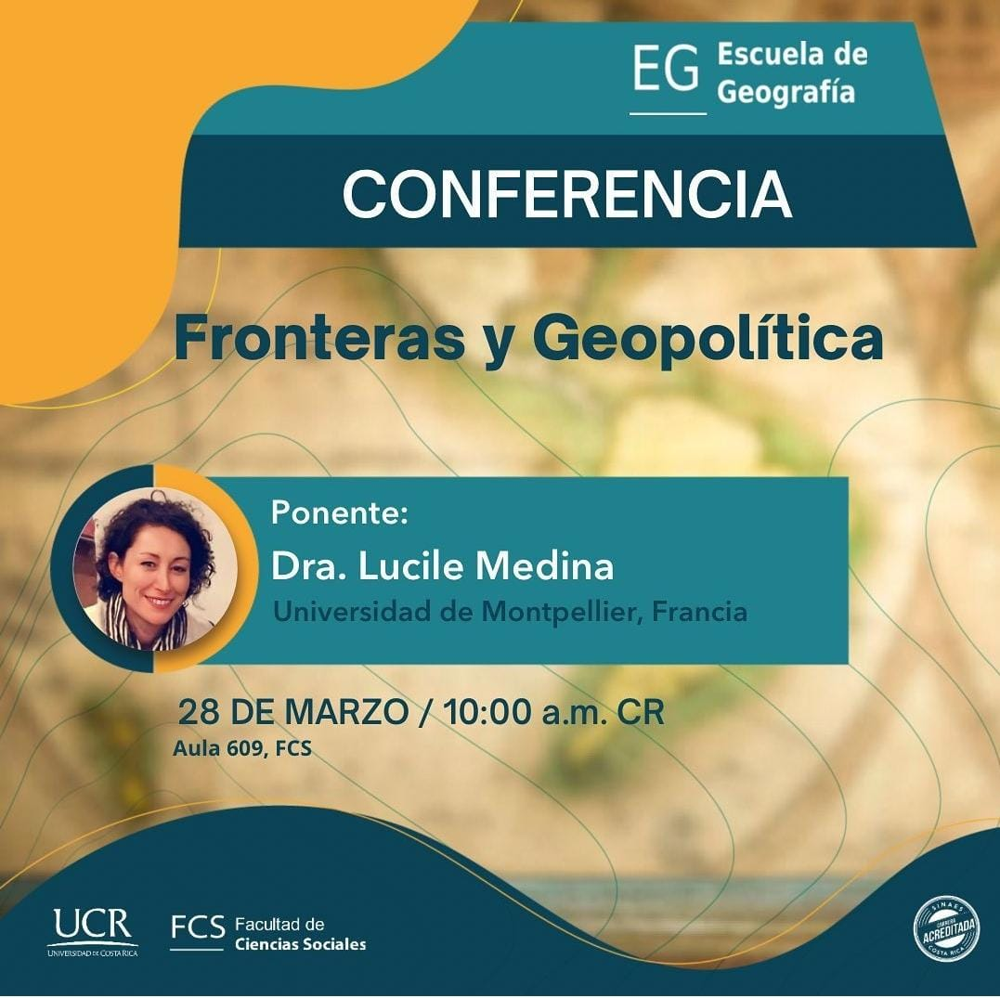

# **Resumen de Conferencia**\
# **_Fronteras y Geopolíticas_**\
Una frontera es un límite de la soberanía y de la competencia territorial de un estado.
Actualmente existen 261 570 km de fronteras en el mundo y 311 segmentos de fronteras. Las fronteras no son siempre sencillas y lineales como lo muestran los mapas, algunos ejemplos de ellos son:\

### **_Francia – España en la frontera Pirineos_**\
Un caso muy particular es Perthus donde la frontera atraviesa la calle principal, siendo la acera izquierda francesa y la derecha española. 
Otro caso muy raro que sucede entre estos dos países se da en La isla de los Faisanes que es un islote fluvial situado cerca de la desembocadura del río Bidasoa, el cual es dirigido por ambos países, es decir tienen una soberanía compartida o más bien alterna en donde Francia tiene la soberanía de agosto a febrero y España de marzo a junio. Teniendo así cada uno el control por seis meses al año. Es importante mencionar que el territorio compartido no está habitado es un monolito que rinde homenaje al Tratado de Paz de los Pirineos de 1659, que se firmó en la Isla de los Faisanes y fue el momento cumbre de su historia.\

También hay enclaves españoles en territorio francés, pero este caso no es único de esos países esto sucede también en otros países un claro ejemplo de ello es: **India y bangladesh**, donde hay enclaves en ambos lados.
En el caso de India y Banglasdesh hay enclaves en ambos lados.\
Las fronteras tienen tres funciones primordiales:\
**1. Lega:** separar territorios en los que se aplican leyes diferentes.\
**2. Física:** Sirve para poder defender el mercado nacional.\
**3. De Control:** permite controlar el cruce de la frontera a personas y mercaderías.\

Las fronteras son un objeto que ha ido evolucionando con el tiempo, es decir están en un constante cambio por guerras, anexiones o por tratados. En la antigüedad las fronteras tenían un carácter sagrado.\ 
En la antigua Roma existe la leyenda de la fundación mítica de Roma, que cuenta como la ciudad fue fundada por los gemelos Rómulo y Remo, hijos del dios Marte y la princesa Rea Silvia. Los gemelos fueron abandonados en el río Tiber para salvarlos de su tío Amulio, quien aspiraba al trono de la ciudad. Los rescató la loba Luperca, que los amamantó, y más tarde fueron criados por pastores.
Con el paso del tiempo los gemelos decidieron fundar una ciudad en una de las siete colinas de Roma. Rómulo eligió el Palatino y Remo el Aventino. Hay muchas versiones diferentes sobre el enfrentamiento entre los hermanos, pero la más aceptada era que Rómulo asesinó a su hermano en el año 753 AC por no respetar las fronteras impuestas por él. Se cree que Rómulo lo asesino y se convirtió en el primer rey de Roma, erigida en lo alto del Palatino.\

### **_Fronteras Antiguas_**\
Actualmente existe pocas marcas fronterizas de la antigüedad por ejemplo la gran muralla china y el muro de Adriano.\

La muralla china fue construida por la dinastía de los Ming, en los siglos XV y XVI, quienes levantaron la muralla que es de al menos 7.000 kilómetros.El proposito de su efificación fuera para poder defenderse de los barbaros.\
\
Figura 1 Muralla china (S/f). Com.mx. Recuperado el 16 de abril de 2023, de https://www.eluniversal.com.mx/resizer/xCL7roGhhtcJhHQhbFxE7e3xEzs=/1200x740/cloudfront-us-east-1.images.arcpublishing.com/eluniversal/AKQROG6PVVCLXM2NZPLZOKUA5Y.jpg \
    \
Figura 2 Muralla china (S/f-b). Istockphoto.com. Recuperado el 16 de abril de 2023, de https://media.istockphoto.com/id/899508826/es/foto/la-gran-muralla-china.jpg?b=1&s=170667a&w=0&k=20&c=tJI_DFKJtodRh7EuRDzZhpRLDivI0WZvvJUChT8Z-MM= \

El muro de Adriano es una antigua fortificación de defensa de la provincia romana de Britania fue iniciada en el año 122 durante el reinado del emperador Adriano. Se creó para proteger el territorio conquistado por Roma de los ataques de las tribus escocesas.\
\
Figura 3 Muro de Adriano (S/f-c). Istockphoto.com. Recuperado el 19 de abril de 2023, de https://media.istockphoto.com/id/1078993764/es/foto/amanecer-de-firery-sobre-39-milecastle-en-el-muro-de-adriano.jpg?s=612x612&w=0&k=20&c=iV55XTpdcdSs_bXNCSztWEaHRqT9c5DtCnGiA1CGcPw= \
El término “frontera como tal no existía antes del siglo XIII. En esos tiempos se basaban en el dominium.
El termino se empieza a usar en 1648 en el tratado de Westfalia y la revolución francesa.\
Los primeros en estudiar la geografía fueron los alemanes. El alemán Friedch Ratzel dice en geografía político, 1897 Que “la frontera es solo una expresión del movimiento exterior, o crecimiento, de los estados” (…) “La naturaleza de los estados es desarrollarse en competencia con los estados vecinos, y lo que está en juego son los territorios” crean el termino **_lebensraum_** que significa espacio vital. Posteriormente el termino lebensraum fue usado por los nazis para justificar sus acciones atroces.

La escuela de geopolítica alemana: Karl Haushofer lo define como un campo de batalla biológico en la vida de los pueblos.\
El francés Lucien Frebvre decía que la frontera no debe de estudiarse y analizarse partiendo de sí misma sino desde el punto de vista del estado.
Jacques Ancel dice que no hay problemas de fronteras, sino de las nacionalidades.\

Actualmente se trata de apreciar las fronteras de una manera renovada, es decir:\
-	Apreciar el proceso de construcción política y social.\
-	Adoptar una perspectiva ascendente y descentrada; como se viven y se cruzan las fronteras.\
-	Considerar las fronteras, ya no como líneas, sino como espacios híbridos e identidades complejas.\
-	Desarrollar una ética de la frontera: asumir más los vínculos entre investigadores y activistas.\
-	Un nuevo esfuerzo de teorización.\

Las fronteras son construcciones humanas políticas y antropológicas. Permiten construir nuevas identidades, pero es importante mencionar que estas no son inmutables, tampoco son naturales, ya que como se mencionó son definidas por los seres humanos.
Las fronteras deben de analizarse en diversas escalas. Actualmente las fronteras son difusas y confusas, ya sea entre países o a niveles más pequeños como lo son los cantones. Muchos mojones o símbolos delimitadores se han perdido o son difíciles de encontrar debido a que se pierden en el entorno. Es decir, hay fronteras poco visibles como la de los Pirineos, ya que no se notan fácilmente los itos que dividen los paises.\ 

\

 Medina L. (28 de marzo de 2023). Fronteras y Geopolítica [Resumen de presentación de la conferencia]. Universidad de Costa Rica, San Jose.
[Escuela de Geografía](https://www.geografia.fcs.ucr.ac.cr/index.php) \ 
[Facebook de la escuela de geografía](https://www.facebook.com/escueladegeografia.ucr/about)

